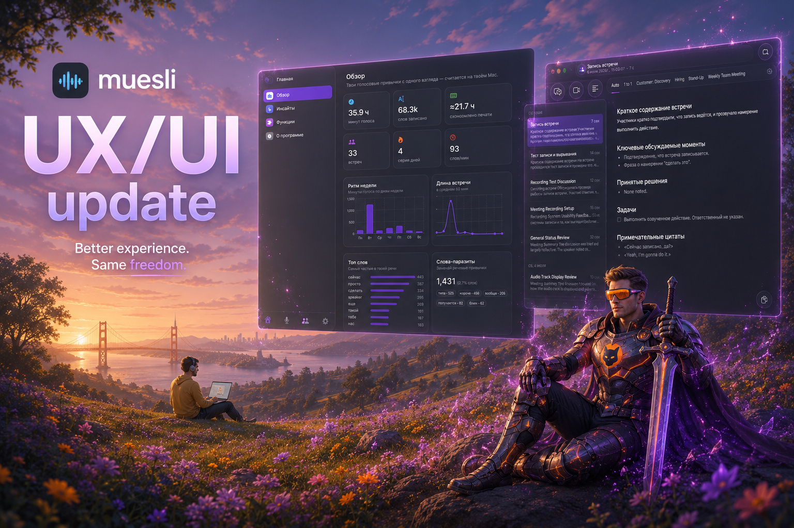
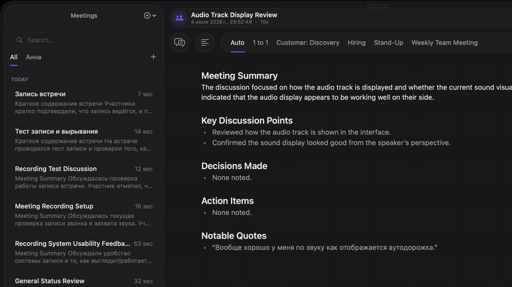
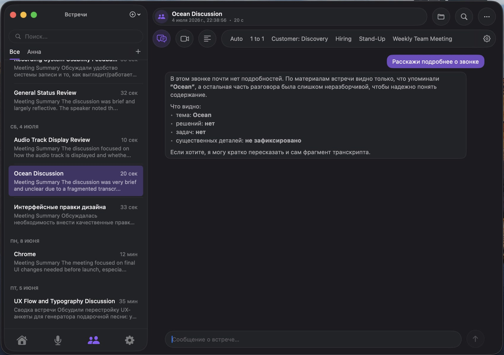
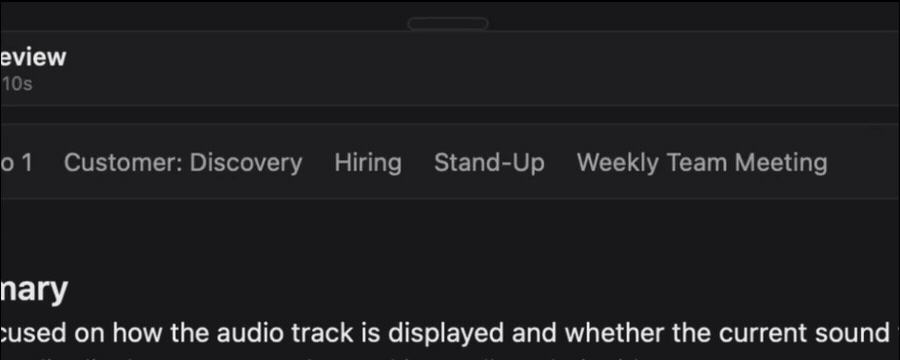
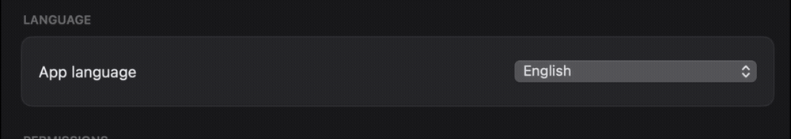

  

<h1 align="center">Muesli · UX/UI Update</h1>

  <strong>Тот же локальный движок. Полностью переосмысленный интерфейс.</strong> 
  Дизайн-форк <a href="https://github.com/Muesli-HQ/muesli">Muesli</a> — нативного приложения для диктовки и транскрипции встреч на macOS.

  
  
  
  

---

## О чём этот форк

**Muesli** — это отличное open-source приложение: вся расшифровка речи работает **локально на Apple Silicon**, без облака, без подписок и без утечки аудио. Технологический фундамент — модели, приватность, движок транскрипции — построил [автор оригинала](https://github.com/Muesli-HQ/muesli).

Этот форк — **мой взгляд как продуктового дизайнера на то, каким может быть интерфейс Muesli.** Я перестроил навигацию, экраны и визуальный язык в духе современных Apple- и Telegram-приложений: карточная вёрстка, плавающие панели, аккуратная типографика, живая аналитика и полная локализация на русский и английский.

> **Это витрина дизайна, а не отдельный продукт.** Движок, приватность и модели — целиком из оригинального Muesli. Некоторые новые экраны ещё допиливаются — честный список в разделе [Статус](#статус).

---

## Обзор за 35 секунд

  

---

## Что переработано

### 📊 Новая «Главная» с аналитикой голоса

Вместо простого списка — панель, которая показывает твои голосовые привычки с одного взгляда: минуты голоса, количество слов, сэкономленное на печати время, серия дней, ритм недели и топ слов-паразитов. Всё считается **локально, на твоём Mac**.

### 💬 Экран встречи в стиле Telegram + шаблоны как вкладки

Плавающая шапка с «пилюлей» заголовка, круглые чипы действий, а шаблоны заметок стали **вкладками** прямо над встречей. Переключаешься между шаблонами — сводка под каждый пересчитывается и кэшируется, так что повторное открытие мгновенно.

  

### 🤖 AI-чат по встрече

Спроси о звонке своими словами — «расскажи подробнее», «какие были решения», «собери задачи» — и получи ответ по материалам встречи. Чат работает и отвечает по транскрипту прямо на странице встречи.

  

### 🎯 Плавающая пилюля с быстрыми действиями

Компактная пилюля, которая живёт поверх любого приложения. При наведении разворачивается в лаунчер с тремя действиями: встреча, диктовка и запись встречи с экраном — без единого лишнего окна.

  

### 🎥 Запись экрана встречи

Помимо аудио, встречу можно писать вместе с экраном — видео сохраняется рядом с транскриптом и доступно прямо на странице встречи. Опция выключена по умолчанию.

  

### 🌍 Полная локализация RU / EN

Каждая строка интерфейса переведена и переключается на лету — русский и английский без перезапуска.

  

---

## Статус

Форк в активной разработке. Честно о том, что уже работает, а что ещё допиливается:

**✅ Готово**
- Новая навигация: нижний таб-бар, карточная левая колонка, кастомное окно
- Экран «Главная» с живой аналитикой голоса
- Переработанный экран встречи, шаблоны как вкладки, кэш сводок под каждый шаблон
- AI-чат по встрече
- Плавающая пилюля с быстрыми действиями
- Запись экрана встречи (опция)
- Полная локализация RU / EN

**🚧 В процессе**
- Перенос нескольких настроек из свежего апстрима в новый дизайн
- Полировка и тесты перед публичным релизом

---

## 💼 Нужен редизайн вашего продукта?

Этот форк — пример того, что я делаю: беру технически сильный, но визуально сырой продукт и превращаю его в приложение, которым приятно пользоваться. **Я прокачаю дизайн любого продукта на GitHub.**

Если у вас есть проект с хорошей технической реализацией, но слабым дизайном — давайте поговорим:

- 📩 **Пришлите запрос на редизайн** со ссылкой на проект — я оценю объём и стоимость.
- 🤝 Если продукт мне понравится и я захочу партнёрство — сделаю редизайн **бесплатно**.
- 💬 В любом случае обсудим, как вывести ваш интерфейс на новый уровень.

  

---

## Оригинальный проект

Весь технологический фундамент — заслуга оригинального Muesli и его автора. Если тебе нужен рабочий продукт, полная документация, установка и релизы — они здесь:

**→ [Muesli-HQ/muesli](https://github.com/Muesli-HQ/muesli)** &nbsp;·&nbsp; [Полный технический README](README.original.md)

Спасибо автору за прекрасную основу и за открытость к экспериментам с дизайном. 🙏

---

## Лицензия

В этом репозитории — две части под разными условиями:

- **Оригинальный код Muesli** — © Pranav Hari, лицензия **[MIT](LICENSE.upstream-MIT)**. Свободно, как и было.
- **Дизайн, визуальные ассеты и новый код этого форка** — © ilnaritto. **Можно свободно использовать, изменять и делиться — но не продавать.** Перепродажа или продажа дизайна в составе платного продукта — только с письменного разрешения.

Право на продажу дизайна предоставляется **только совместно с автором оригинального Muesli**. По вопросам перепродажи — [напишите в Issues](https://github.com/ilnaritto/muesli/issues).

Полные условия — в файле **[LICENSE](LICENSE)**.
