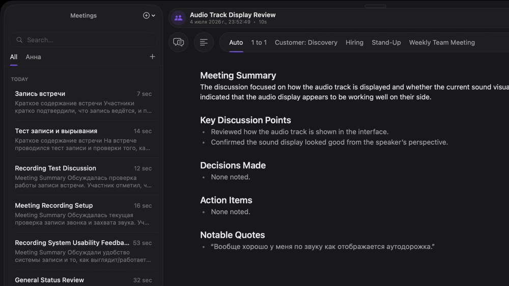
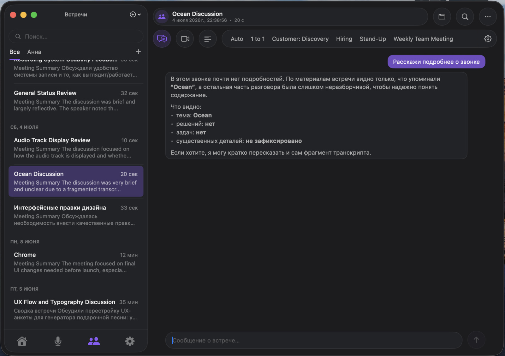
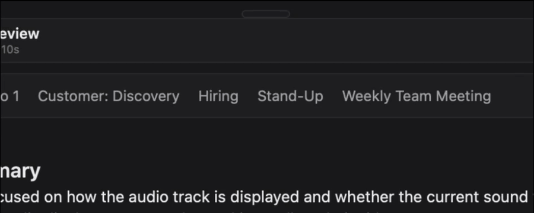
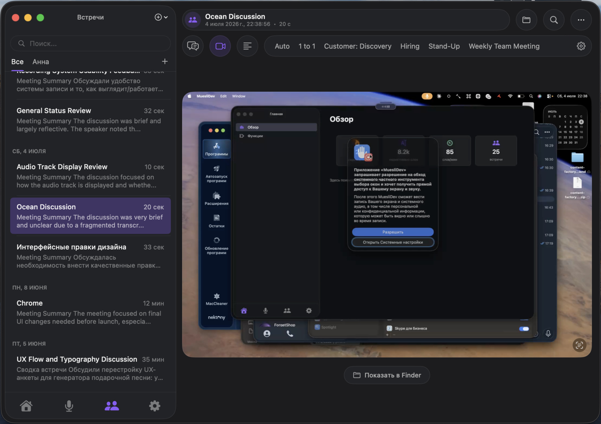
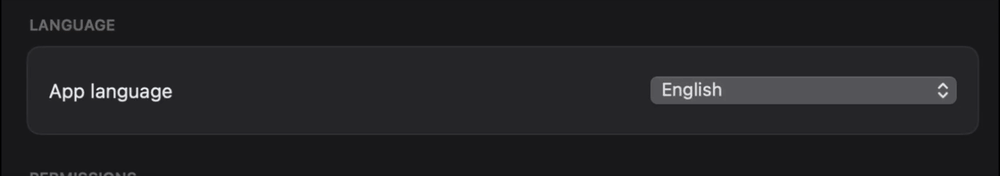

  
  

  

<h1 align="center">Muesli · UX/UI Update</h1>

  <strong>The same local engine. A completely reimagined interface.</strong> 
  A design-focused fork of <a href="https://github.com/Muesli-HQ/muesli">Muesli</a> — a native macOS app for dictation and meeting transcription.

  
  
  
  

---

## About this fork

**Muesli** is a superb open-source app: all speech recognition runs **locally on Apple Silicon** — no cloud, no subscriptions, and your audio never leaves your Mac. The technical foundation — the models, the privacy, the transcription engine — was built by the [original author](https://github.com/Muesli-HQ/muesli).

This fork is **my take, as a product designer, on what Muesli's interface could be.** I rebuilt the navigation, the screens, and the visual language in the spirit of modern Apple and Telegram apps: card-based layouts, floating panels, careful typography, live analytics, and full Russian/English localization.

> **This is a design showcase, not a separate product.** The engine, the privacy, and the models all come from the original Muesli. Some new screens are still being finished — an honest list is in the [Status](#status) section.

---

## 35-second overview

  

---

## Why Muesli

Normally this means paying two separate subscription apps: one for dictation, another for meeting notes. **Muesli does both at once — and runs right on your Mac.**

**1. Three tools in one**
- 🎙 **Dictation** — hold a hotkey, speak, release → text is pasted right where your cursor is. ~0.13s latency.
- 👥 **Meetings** — records your mic and system audio at the same time, separates speakers, and hands you a finished transcript seconds after you stop.
- 📊 **Analytics** — how much you've spoken, how much typing time you've saved, your speech habits, and your top filler words.

**2. 100% local and private**
All speech recognition runs on your Mac, on the Apple Neural Engine. Your audio goes nowhere. No cloud, no monthly subscription, no per-minute bills — it just works, for free.

**3. And when you want maximum quality — the cloud, for pennies**
Want even sharper, more structured meeting notes? Plug in an online model — OpenAI, OpenRouter, or your own ChatGPT subscription. You pay **directly for usage**, with no monthly subscription — literally pennies per meeting. Local is free; go online only when you decide to raise the bar.

**4. Native and fast**
Pure Swift — no Electron, no Python. Light, fast, and tuned for Apple Silicon, not yet another browser wrapped in an app.

**5. A design worth opening the app for**
Exactly what you see on this page: card layouts, floating panels, live analytics, templates, and full localization. A powerful engine finally gets an interface to match.

---

## What's been redesigned

### 📊 A new "Home" with voice analytics

Instead of a plain list — a dashboard that shows your voice habits at a glance: minutes spoken, words captured, typing time saved, day streak, weekly rhythm, and top filler words. All computed **locally, on your Mac**.

### 💬 A Telegram-style meeting screen + templates as tabs

A floating header with a title "pill," round action chips, and note templates turned into **tabs** right above the meeting. Switch between templates and the summary for each is recomputed and cached — so reopening is instant.

  

### 🤖 AI chat about a meeting

Ask about the call in your own words — "tell me more," "what were the decisions," "pull out the action items" — and get an answer based on the meeting's content. The chat works and responds from the transcript, right on the meeting page.

  

### 🎯 A floating pill with quick actions

A compact pill that lives on top of any app. On hover it expands into a launcher with three actions: meeting, dictation, and screen-recorded meeting — without a single extra window.

  

### 🎥 Meeting screen recording

Beyond audio, a meeting can be recorded together with your screen — the video is saved next to the transcript and available right on the meeting page. Off by default.

  

### 🌍 Full RU / EN localization

Every string in the interface is translated and switches on the fly — Russian and English, no restart.

  

---

## Status

The fork is under active development. Honestly, here's what already works and what's still being finished:

**✅ Done**
- New navigation: bottom tab bar, card-based left column, custom window
- "Home" screen with live voice analytics
- Redesigned meeting screen, templates as tabs, cached summary per template
- AI chat about a meeting
- Floating pill with quick actions
- Meeting screen recording (optional)
- Full RU / EN localization

**🚧 In progress**
- Porting a few settings from the latest upstream into the new design
- Polish and testing before a public release

---

## Work with me

This fork is a clear example of what I do: I take a product with a strong technical foundation and bring its interface up to a level that makes people actually want to open the app.

I don't take on everything. I'm interested in projects with a solid engineering core that are one thing away from greatness — the design. The format depends on the project: a paid redesign, or a design partnership in products I genuinely believe in. I take on a limited number of projects at a time so each one gets my full attention.

If that sounds like your product — let's talk.

  
  &nbsp;
  

---

## The original project

The entire technical foundation is the work of the original Muesli and its author. If you want the working product, full documentation, installation, and releases — they're here:

**→ [Muesli-HQ/muesli](https://github.com/Muesli-HQ/muesli)** &nbsp;·&nbsp; [Full technical README](README.original.md)

Thanks to the author for a wonderful foundation and for being open to design experiments. 🙏

---

## License

This repository contains two parts under two different sets of terms:

- **The original Muesli code** — © Pranav Hari, licensed under **[MIT](LICENSE.upstream-MIT)**. Free, as it always was.
- **The design, visual assets, and new code of this fork** — © ilnaritto. **Free to use, modify, and share — but not to sell.** Reselling, or selling the design as part of a paid product, requires written permission.

The right to sell and commercially license the design stays **with the design's author (ilnaritto)**. To buy, license, or discuss a partnership — reach out on [Telegram](https://t.me/ilnaritto) or via [Issues](https://github.com/ilnaritto/muesli/issues).

Full terms are in the **[LICENSE](LICENSE)** file.
